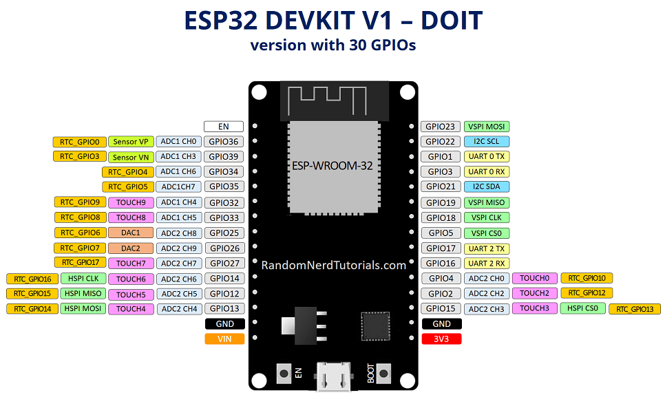

# ESP32相关实验

## ESP32

## 实验项目
1. [led流水灯/呼吸灯](./src/led)
2. [lcd1602](./src/lcd1602)
3. [有源/无源蜂鸣器](./src/buzzer)
4. [4*4矩阵键盘](./src/keyboard)
5. [双轴按键](./src/ps2)
6. [舵机](./src/servo)
7. [震动传感器](./src/shake)
8. [倾斜传感器](./src/tilt)
9. [wifi](./src/wifi)
10. [步进电机](./src/step)
11. [超声波传感器](./src/ultrasound)
12. [tft液晶屏](./src/tft)

## 参考文档

[ESP32单片机](https://docs.geeksman.com/esp32/#%E7%9B%AE%E5%BD%95-arduino)